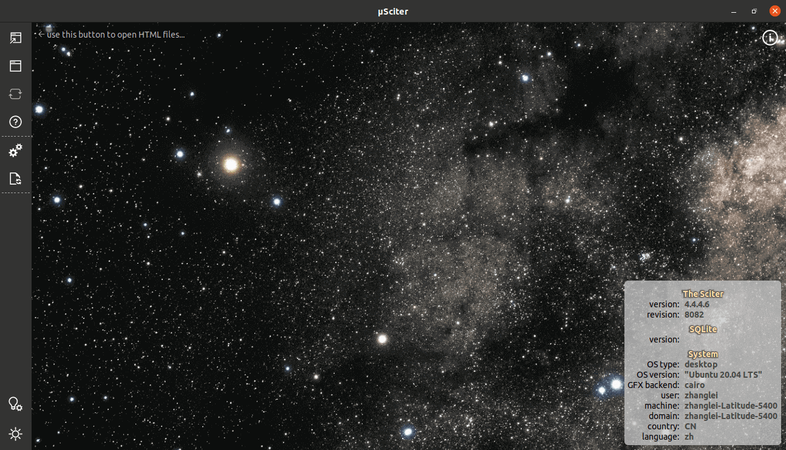
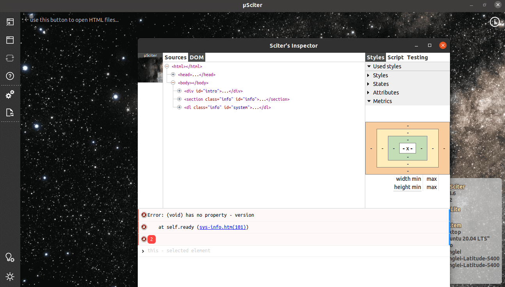

### About PHPSciter


[](https://ci.appveyor.com/project/Neeke/phpsciter)

* 目前仅支持zts


PHPSciter is a PHP extension to bind the [Sciter](http://www.sciter.com/) framework which is a cross platform GUI framework.
### Contact us
Email: [wwccss@gmail.com](wwccss@gmail.com)
QQ: 546025324
### 关于PHPSciter
[Sciter](http://www.sciter.com)是一个非常优秀的的跨平台的GUI框架，它使用HTML5 + CSS来绘制界面，使用TIScritpt来做交互。 PHPSciter是一个PHP绑定Sciter的扩展。


### 联系我们
Email: [wwccss@gmail.com](wwccss@gmail.com)
QQ: 546025324


### Install Sciter
Download the [sciter-sdk][]

1. Put Sciter's dynamic library directly into the same location as the PHP executable files.
2. Extract the sciter runtime library from [sciter-sdk][] to system PATH

    The runtime libraries lives in `bin` `bin.gtk` `bin.osx` with suffix like `dll` `so` or `dylib`

    * Windows: simply copying `bin\64\sciter.dll` to `c:\windows\system32` is just enough
    * Linux: 
      - `cd lib/sciter/linux`
      - `tar zxvf libsciter-gtk-lnx.tar.gz`
      - `echo $PWD >> libsciter.conf`
      - `sudo cp libsciter.conf /etc/ld.so.conf.d/`
      - `sudo ldconfig`
      - `ldconfig -p | grep sciter` should print libsciter-gtk-64.so location
    * OSX:
      - `cd lib/sciter/mac`
      - `export DYLD_LIBRARY_PATH=$PWD`
      
#### Windows 

- Please put "phpsciter.dll" to php.exe/extension folder

#### Ubuntu 16.04
```
apt-get install build-essential pkg-config
apt install libgtk-3-dev

git clone https://github.com/longyan/phpsciter.git
cd phpsciter
phpize
./configure
make
make install

php examples/phpsciter-load-frame/index.phpt
```

#### Mac OS
```
git clone https://github.com/longyan/phpsciter.git
cd phpsciter
phpize
./configure
make
make install

php examples/phpsciter-load-frame/index.phpt
```

#### Notice!

 - If you used "make clean function", you have to do configuration again.
 
#### Debug

 - 如何进行Sciter软件方面的调试？

 - 需要将sciter-sdk下面的inspector 拷贝到 与php.exe 同级目录下，点击Dom inspector
 
  

 
